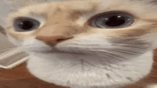

# GATITO SUSPEITO

## respondendo suas questões absurdas

##### O que significa o git add?
###### adiciona as modificações na camada de stash

##### O que significa o git pull?
###### puxa as informações de alguma branch para a branch atual

##### Como acessar uma branch?
###### git checkout >branch<

##### Como trocar de branch?
###### git checkout >branch<

##### Como deletar uma branch?
###### git branch -d >nome-da-branch<

##### Para resolver o conflito do código, por que é preferível utilizar o rebase em vez do merge?
###### 

##### Como inserir apenas um commit de uma branch para a main?
######

##### Como fazer um Pull-Request?
###### 

##### Como adicionar Reviewers em seu repositório?
###### 